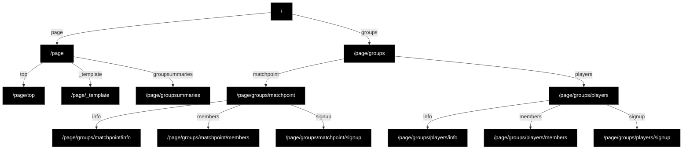

# content

## External links to file map

| External URL | Repository File | Title and/or Description |
|-------------|-----------------|-------------|
| https://pelicanbaytennisgroups.com/ | [page/top.md](/page/top.md) | Tennis Groups at Pelican Bay (Landing page) |
| https://pelicanbaytennisgroups.com/_template | [page/_template.md](/page/_template.md) | example - Information on Groups |
| https://pelicanbaytennisgroups.com/groupsummaries | [page/groupsummaries.md](/page/groupsummaries.md) | Pelican Bay Tennis Groups - Information on Groups |
| https://pelicanbaytennisgroups.com/groups/matchpoint/info | [page/groups/matchpoint/info.md](/page/groups/matchpoint/info.md) | MatchPoint Group FAQs - MatchPoint FAQs |
| https://pelicanbaytennisgroups.com/groups/matchpoint/members | [page/groups/matchpoint/members.md](/page/groups/matchpoint/members.md) | MatchPoint Members Page - Current Month Pairings and Next Month Signup |
| https://pelicanbaytennisgroups.com/groups/matchpoint/signup | [page/groups/matchpoint/signup.md](/page/groups/matchpoint/signup.md) | Signup form for MatchPoint members |
| https://pelicanbaytennisgroups.com/groups/players/info | [page/groups/players/info.md](/page/groups/players/info.md) | The Players Group FAQs - Players FAQs |
| https://pelicanbaytennisgroups.com/groups/players/members | [page/groups/players/members.md](/page/groups/players/members.md) | The Players Members Page - Schedules and Signup |
| https://pelicanbaytennisgroups.com/groups/players/signup | [page/groups/players/signup.md](/page/groups/players/signup.md) | Signup form for Players members |

## Sitemap

